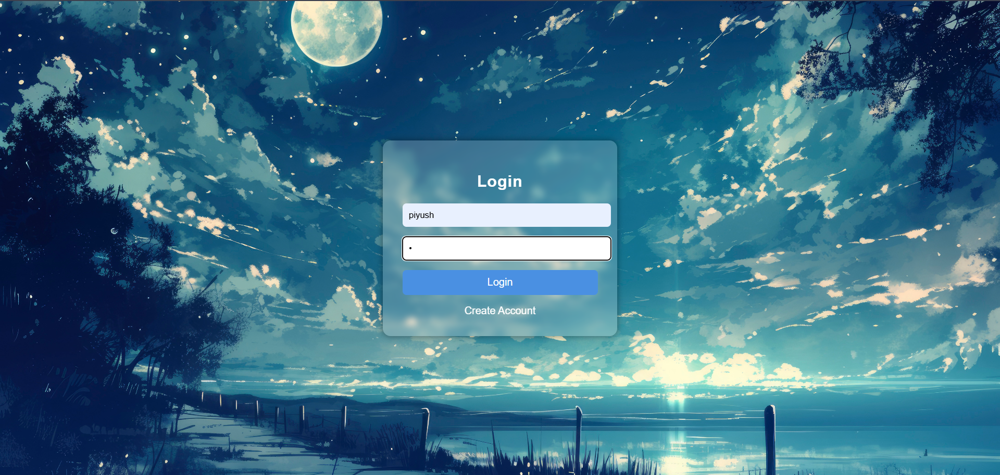
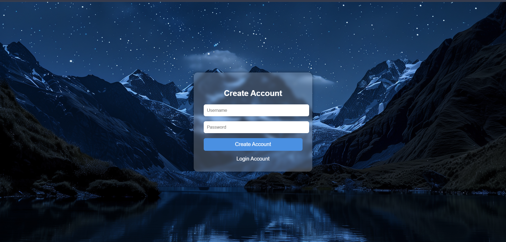
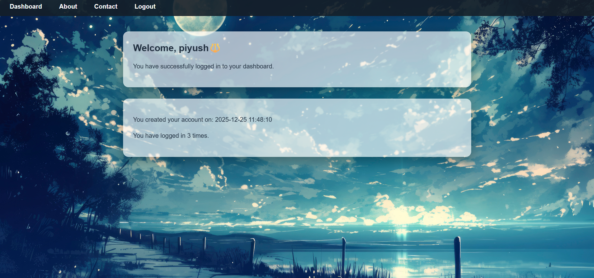
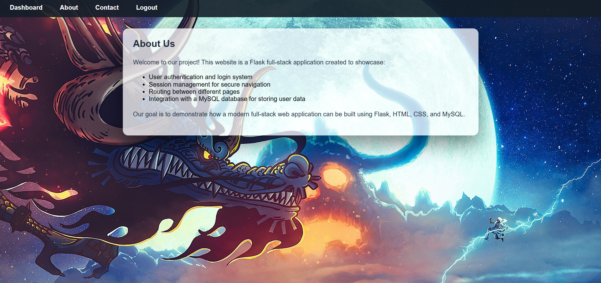
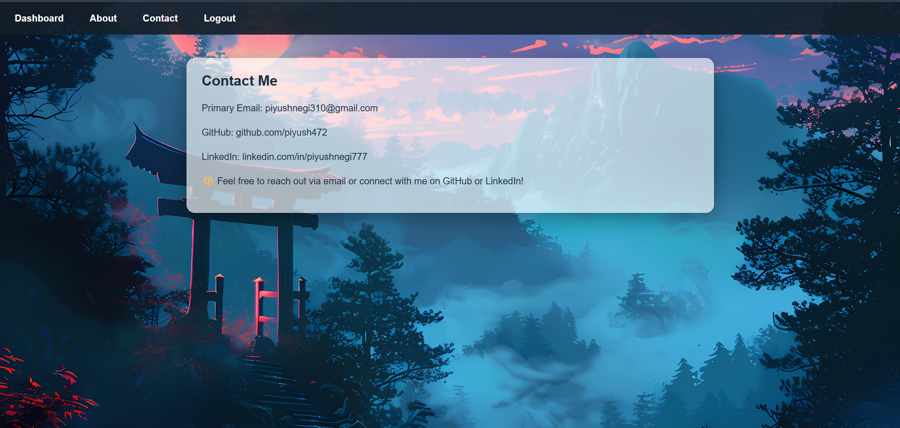

# Flask Authentication Web App

    This is my first full stack backend project using Flask and MySQL.
    I made this project to understand how backend works, user authentication, database connection and password security.

    The app allows users to register, login and access a protected dashboard.

---

# Features

    * User Registration & Login

    * Password hashing (secure passwords, not stored in plain text)

    * Session based authentication

    * Protected routes (login required)

    * MySQL database connection

    * Environment variables using .env file

---

# Tech Stack Used

    * Python

    * Flask

    * MySQL

    * HTML / CSS

    * Flask Sessions

    * python-dotenv

---

# Why I Made This Project

    # I made this project to build strong backend basics.
      While making this app I learned:

        * How login & signup system works

        * How password hashing works

        * How to connect Flask with MySQL

        * How sessions and protected routes work

        * How to debug real errors (duplicate users, hashing issues, db errors)

        * This project helped me understand real backend flow instead of only theory.

---

# How It Works (Simple Flow)

    * User registers with username and password

    * Password is hashed before saving in database

    * User logs in using credentials

    * Session is created after successful login

    * User can access dashboard only if logged in

---

## 📸 Screenshots
---

### 🔑 Login Page

### 📝 Signup Page

### 🧑‍💻 User Dashboard

### 🧑‍💻 Aboutus Page

### 🧑‍💻 Contact Page

